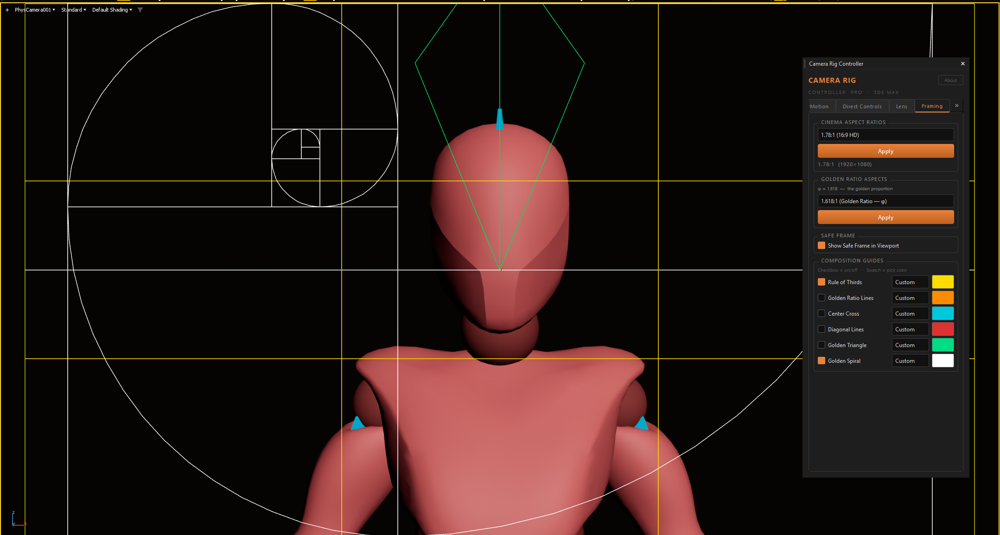
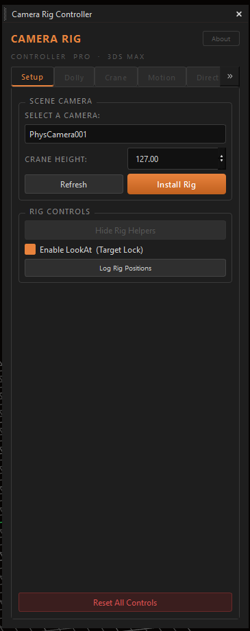
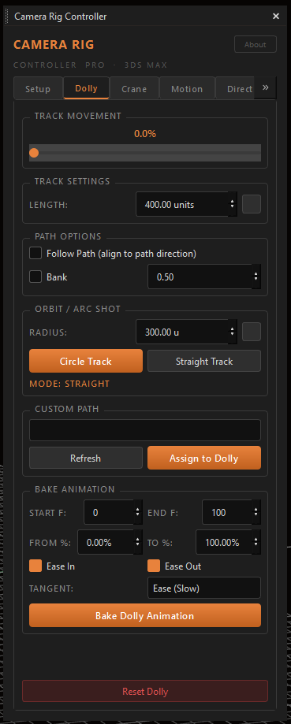
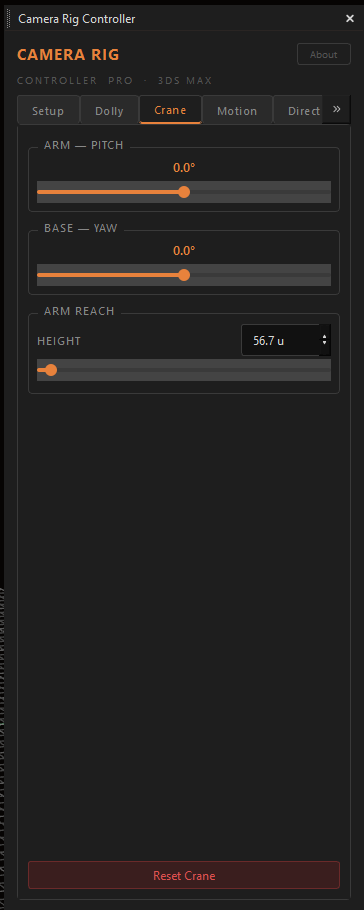
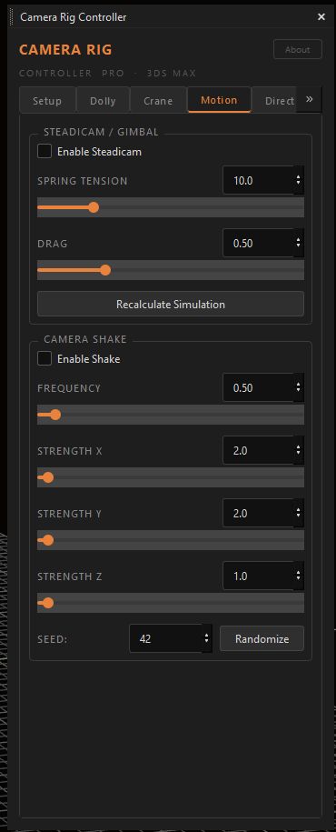
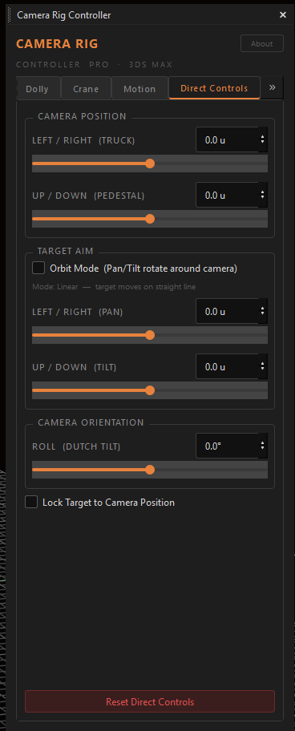
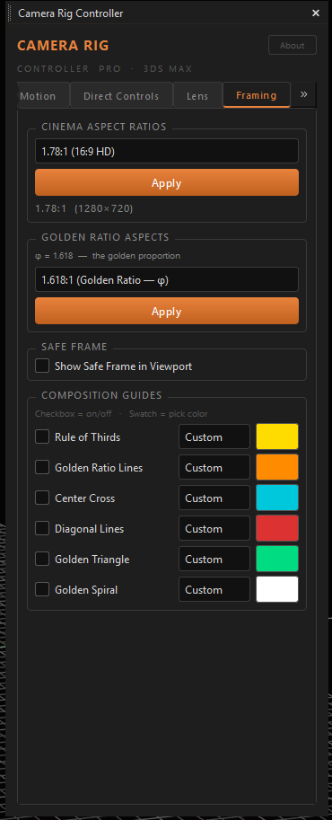
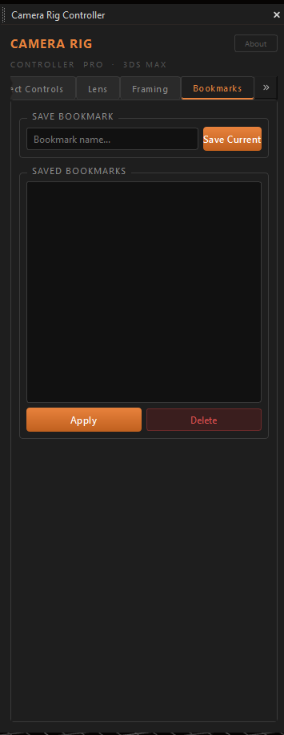
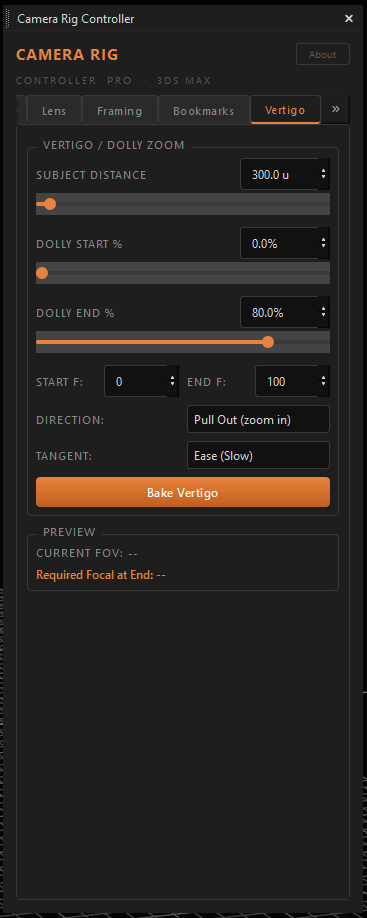
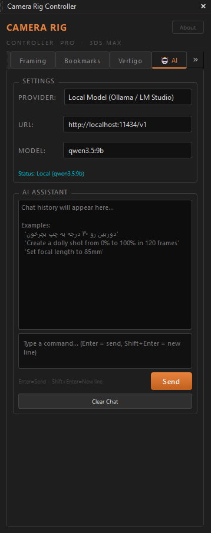

# Camera Rig Controller PRO


[](https://www.paypal.com/donate/?hosted_button_id=LAMNRY6DDWDC4)


A professional camera rigging tool for **3ds Max**, built with Python and PySide6.  
Control your camera rig with natural language using the built-in **AI Agent** — powered by Claude API or local models via Ollama / LM Studio.




---

## ✨ Features

### Rig System
- One-click rig installation on any camera type (Standard, Physical, VRay, Corona)
- Full crane + dolly hierarchy: `DOLLY → CRANE_BASE → CRANE_ARM → MASTER → PIVOT → Camera`
- Adjustable crane height before install



### Dolly Tab
- Path-based dolly movement with percentage control
- Straight track with resizable length
- Orbit / Arc Shot — circular track around subject
- Custom path assignment with Flow and Bank support
- Bake dolly animation with Ease In/Out and tangent control



### Crane Tab
- Arm pitch (X rotation)
- Base yaw (Z rotation)
- Arm reach / height control



### Motion Tab
- **Steadicam** — lag helper node between dolly and crane
- **Camera Shake** — Noise Position controller on pivot with per-axis strength, frequency, and seed



### Direct Controls Tab
- Truck (left/right relative to camera direction)
- Pedestal (up/down)
- Pan — Linear or Orbit mode
- Tilt (up/down)
- Roll / Dutch Tilt
- Lock Target to Camera toggle



### Lens Tab
- Focal length control (universal — works with all camera types)
- Near/Far clip planes
- DOF enable + Focus Distance
- Rack Focus — bake animated focus pull between two distances
- Focus Subject Picker — click any object to set focus distance
- Camera property logger for debugging


### Framing Tab
- Cinema aspect ratio presets (2.39:1, 1.85:1, 16:9, IMAX, and more)
- Golden Ratio aspect presets (φ, √φ, φ²)
- Safe Frame toggle
- Composition guides overlay directly on viewport:
  - Rule of Thirds
  - Golden Ratio Lines
  - Center Cross
  - Diagonal Lines
  - Golden Triangle
  - Golden Spiral
- Per-guide color picker with color presets



### Bookmarks Tab
- Save named camera position snapshots
- Restore any saved bookmark instantly
- Delete bookmarks



### Vertigo Tab
- Dolly Zoom (Hitchcock effect) — simultaneous dolly movement and focal length change
- Preview panel showing required focal length at end frame
- Push In / Pull Out direction



### 🤖 AI Agent Tab
- Natural language camera control in **English or Farsi**
- Powered by **Claude API** (Anthropic) or any **local model** via Ollama / LM Studio
- Multi-turn conversation with full rig context awareness
- Chains multiple tool calls to execute complex cinematic shots in one prompt
- All 20+ rig actions exposed as AI tools



---

## 📒 Requirements

- **3ds Max 2025+**
- **Python 3.x** (bundled with 3ds Max)
- **PySide6** (bundled with 3ds Max 2025+)
- **AI Agent** *(optional)*: Claude API key **or** Ollama / LM Studio running locally

---

## 📦 Installation

1. Clone or download this repository
2. Place the folder anywhere on your system
3. In 3ds Max, open the **MAXScript Editor** or **Script** menu
4. Run the file: `Camera Rig Controller PRO.py`

```
Camera Pro/
├── Camera Rig Controller PRO.py   ← Run this
├── assets/
│   └── shape.max                  ← Custom rig shapes (optional)
└── camera_rig/
    ├── core/                      ← 3ds Max logic
    └── ui/                        ← PySide6 interface
```

---

## Custom Shapes

To use custom shapes for rig controls, create a `shape.max` file inside the `assets/` folder containing objects with these exact names:

| Object Name  | Rig Node     |
|--------------|--------------|
| `DOLLY_CTRL` | Dolly        |
| `CRANE_BASE` | Crane Base   |
| `CRANE_ARM`  | Crane Arm    |
| `MASTER`     | Master       |
| `PIVOT`      | Pivot        |
| `TARGET`     | Target       |
| `TRACK_CTRL` | Track Handle |

If a shape is not found in the file, a primitive fallback is used automatically.
Note - you can make any shape you  want.
---

## Usage

1. **Setup Tab** — Select a camera, set Crane Height, click **Install Rig**
2. **Dolly Tab** — Move the camera along the track, create orbit paths
3. **Crane Tab** — Adjust crane arm pitch, base rotation, and reach
4. **Direct Controls** — Fine-tune camera and target position
5. **Lens Tab** — Control focal length, clipping, and depth of field
6. **Framing Tab** — Set aspect ratio and enable composition guides on viewport
7. **Motion Tab** — Add camera shake or steadicam simulation
8. **AI Agent Tab** — Type natural language commands to control the entire rig

---

## 🤖 AI Agent

Control the full camera rig with natural language. Works in **English** and **Farsi**.

### Setup

**Option A — Claude API (Cloud)**
1. Get an API key from [console.anthropic.com](https://console.anthropic.com)
2. In the AI tab, select **Claude** as provider and paste your key

**Option B — Local Model (Ollama)**
```bash
ollama pull qwen2.5:7b
# or any model that supports tool calling
ollama serve
```
In the AI tab, select **Local Model**, set URL to `http://localhost:11434/v1`, and enter the model name.

**Option C — LM Studio**
1. Load any GGUF model in LM Studio
2. Start the local server (default port 1234)
3. Set URL to `http://localhost:1234/v1` in the AI tab

---

### 💬 Prompt Examples

#### Basic Controls
```
Move the dolly to 75%
```
```
Tilt the crane arm up 30 degrees
```
```
Set focal length to 85mm
```
```
Roll the camera 5 degrees for a dutch tilt
```

#### Animation
```
Create a dolly animation from 0% to 100% between frames 0 and 150 with ease in and ease out
```
```
Set a keyframe at frame 0 with dolly at 0%, then at frame 100 with dolly at 50%
```

#### Orbit Shots
```
Create a circular orbit track with radius 200 around the subject
```
```
Create orbit track radius 150 and enable follow path with banking
```

#### Cinematic Shots (multi-tool)
```
Set up a dramatic low-angle shot: crane height 30, pitch up 20 degrees, focal length 35mm
```
```
Create a slow push-in: set focal length to 200mm, move dolly to 20%, then bake a dolly animation from 20% to 80% over 200 frames with ease in
```
```
Classic Hitchcock vertigo effect setup: create orbit track radius 300, enable follow path, set focal length 50mm
```

#### Camera Shake
```
Enable subtle camera shake with frequency 0.3 and strength 2
```
```
Add handheld camera feel: shake frequency 1.5, strength 5
```
```
Disable camera shake
```

#### Framing & Composition
```
Show rule of thirds and golden ratio guides on the viewport
```
```
Set aspect ratio to 2.39 anamorphic widescreen
```
```
Enable safe frame with 16:9 aspect ratio
```
```
Show all composition guides — thirds, golden ratio, diagonals, and center cross
```

#### Farsi / Persian
```
دوربین رو ۴۵ درجه به چپ بچرخون
```
```
یه شات دایره‌ای با شعاع ۲۰۰ واحد بساز و follow path رو فعال کن
```
```
یه انیمیشن دولی از فریم ۰ تا ۱۵۰ با ease in و ease out بپز
```
```
فوکال لنگث رو ۸۵ میلیمتر بذار و یه لرزش دوربین ملایم اضافه کن
```
```
وضعیت فعلی دوربین رو بگو
```

#### Reset
```
Reset everything to default
```
```
Reset the dolly — remove all keyframes
```
```
Restore the straight track and reset the crane
```

---

## Architecture

```
camera_rig/
├── constants.py          — VERSION, URLs
├── theme.py              — Dark palette + QSS stylesheet
├── widgets/
│   ├── slider_spin_row.py — Slider + Spinbox compound widget
│   └── about_dialog.py
├── core/                 — Pure 3ds Max logic (no Qt)
│   ├── rig_builder.py    — Install, cleanup, load rig
│   ├── rig_controls.py   — Dolly, crane, direct controls
│   ├── rig_utils.py      — State reading, helpers
│   ├── lens_controls.py  — Focal, clipping, DOF (universal)
│   ├── camera_shake.py   — Noise Position controller
│   ├── steadicam.py      — Lag simulation
│   ├── rack_focus.py     — Focus pull animation
│   ├── vertigo.py        — Dolly zoom
│   └── bookmarks.py      — Shot bookmarks
├── framing/
│   └── viewport_overlay.py — Aspect ratios + composition guides
├── ai/                   — AI Agent (no extra dependencies)
│   ├── agent.py          — Claude API + OpenAI-compatible local models
│   ├── tools.py          — Tool definitions (JSON schema for 20+ rig actions)
│   └── executor.py       — Bridge between tool calls and rig functions
└── ui/
    ├── main_window.py    — CameraRigUI bridge class
    └── tabs/             — One file per tab
```

---

## Supported Camera Types

| Camera | Focal Length | Clipping | DOF |
|--------|-------------|---------|-----|
| Standard Free/Target | ✅ | ✅ | ✅ |
| Physical Camera | ✅ | ✅ | ✅ |
| VRay Physical Camera | ✅ | ✅ | ✅ |
| Corona Camera | ✅ | ✅ | ✅ |
| Octane Camera | ✅ | ✅ | ❌ |

---

## License

MIT License — free for personal and commercial use.

---

## Author

**Iman Shirani**

- GitHub: [github.com/imanshirani](https://github.com/imanshirani)
- Support: [PayPal Donate](https://www.paypal.com/donate/?hosted_button_id=LAMNRY6DDWDC4)
